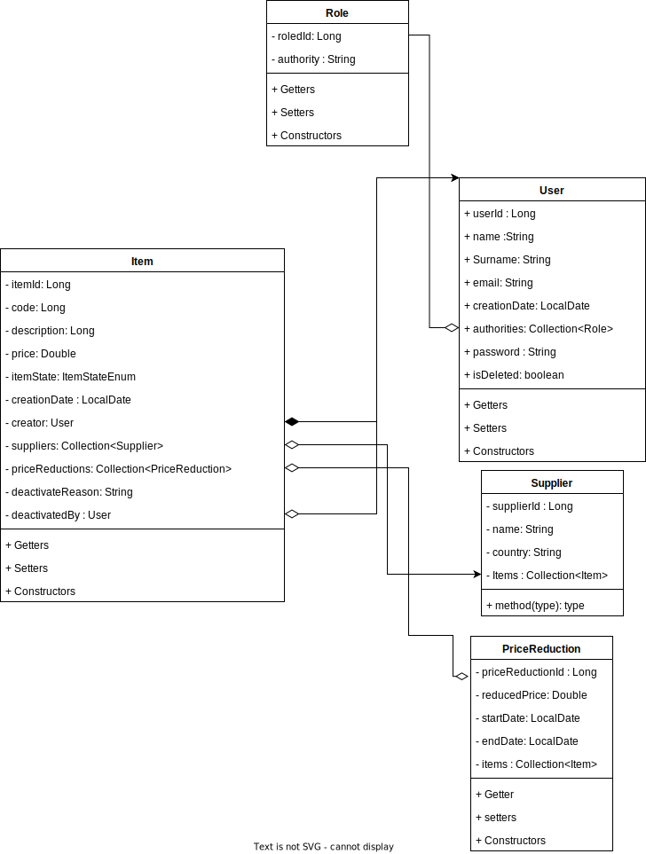

# BitBoxer 2 Backend

## How to start

To start the backend service you will need the next things:

* And IDE (intelliJ recommended)
* A good pc (enough ram to have the server on at least 2 GB free)
* In case of linux base systems create a file bb2.mvn.db inside a data folder. full route: /data/bb2.mv.db

## Have in mind
The app properties can be modified here is the app properties file of the project
```
spring.h2.console.enable=true # deactivable
spring.datasource.url=jdbc:h2:file:/data/bb2;MODE=PostgreSQL;DATABASE_TO_LOWER=true # try no to change
spring.datasource.driverClassName=org.h2.Driver
spring.datasource.username=username
spring.datasource.password=password
spring.jpa.database-platform= org.hibernate.dialect.H2Dialect # do not change 
server.port=5050 # app port can be changed
spring.jpa.hibernate.ddl-auto=update
spring.jpa.show-sql=true #deactivabledeactivable
```


## UML Diagram

This diagram only contains the Models - Entities used on the app.
